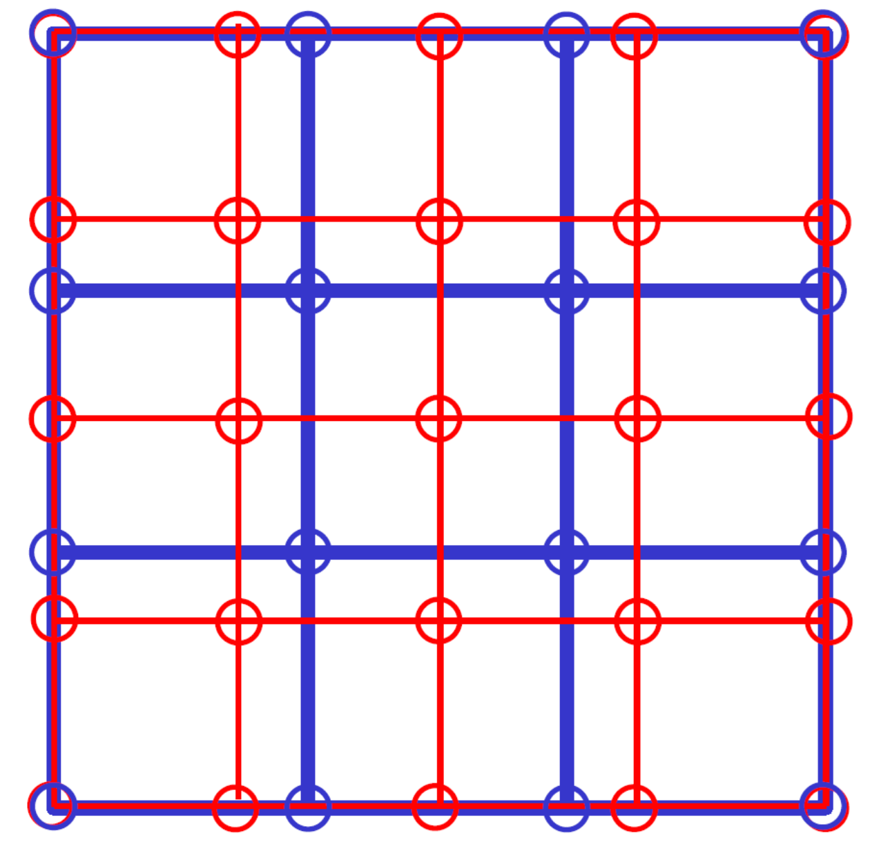
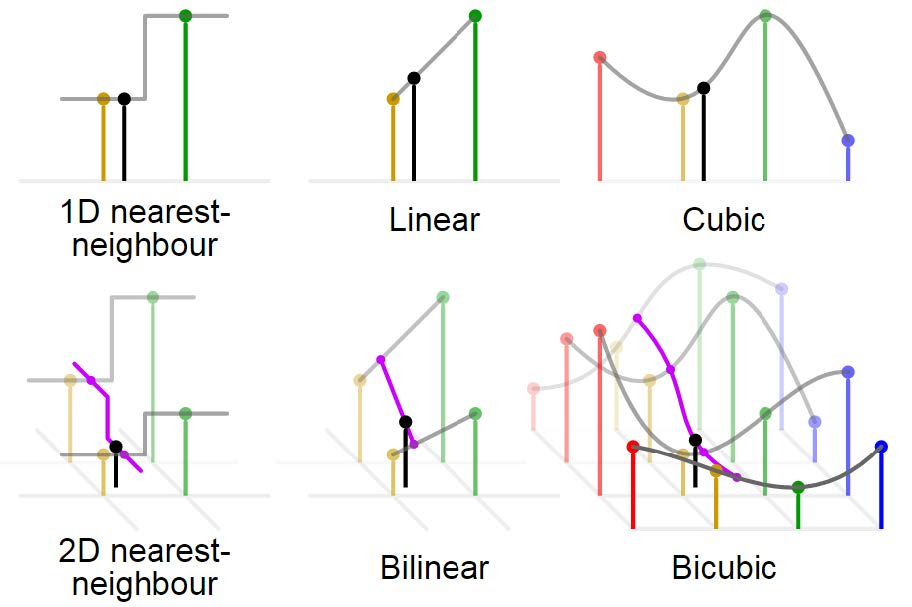
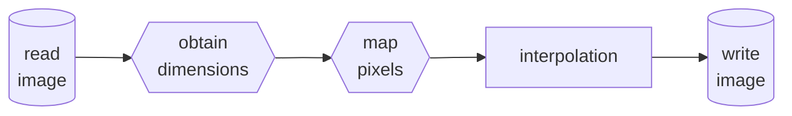
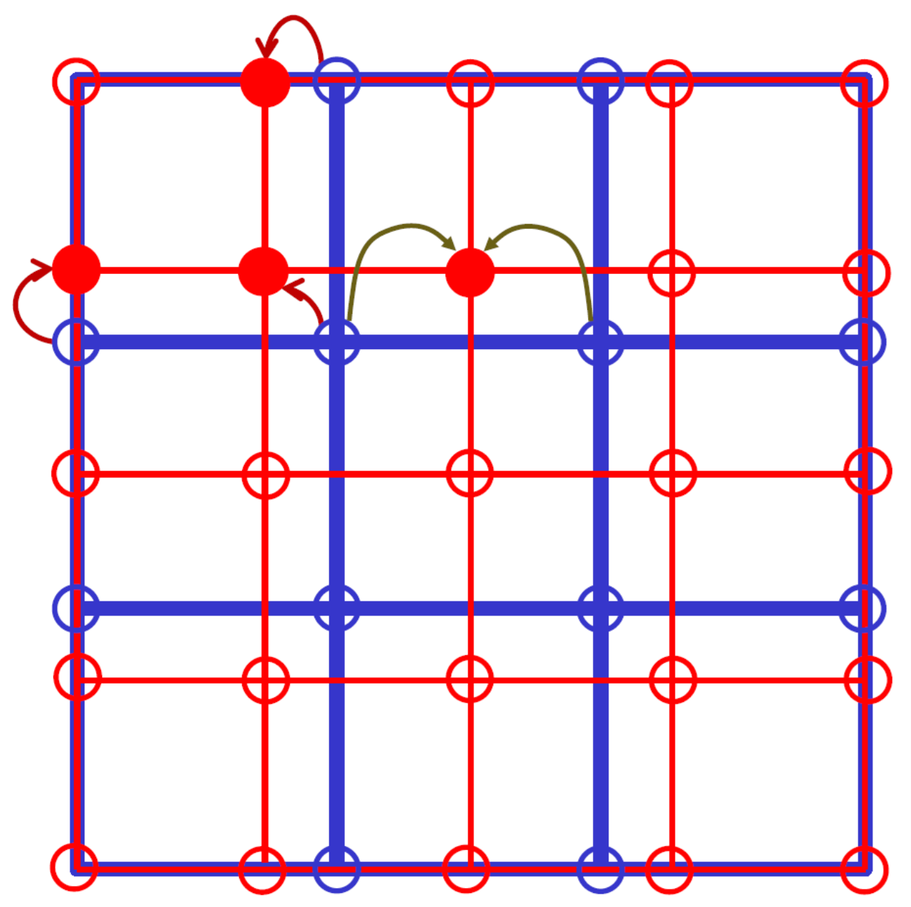
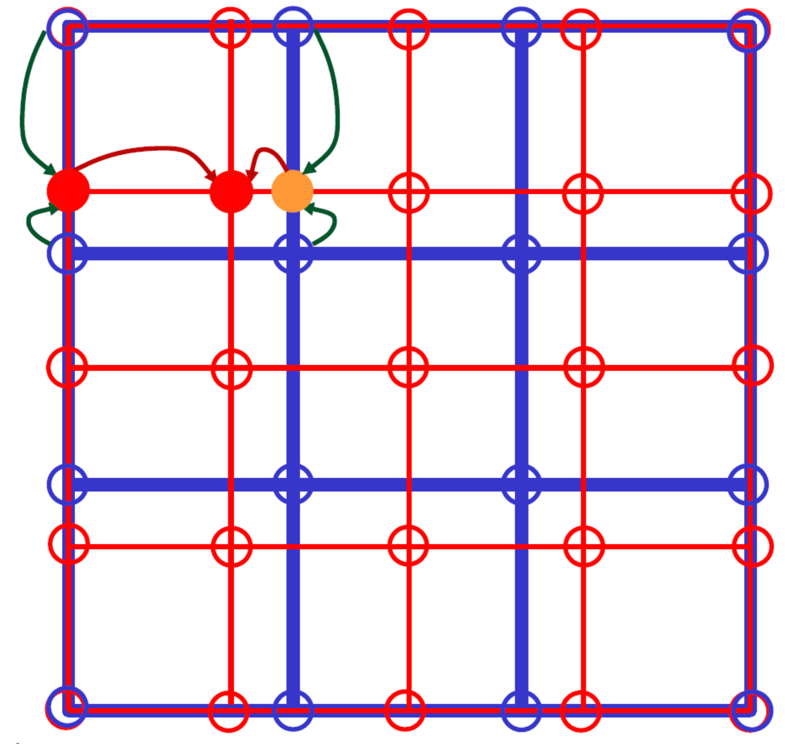
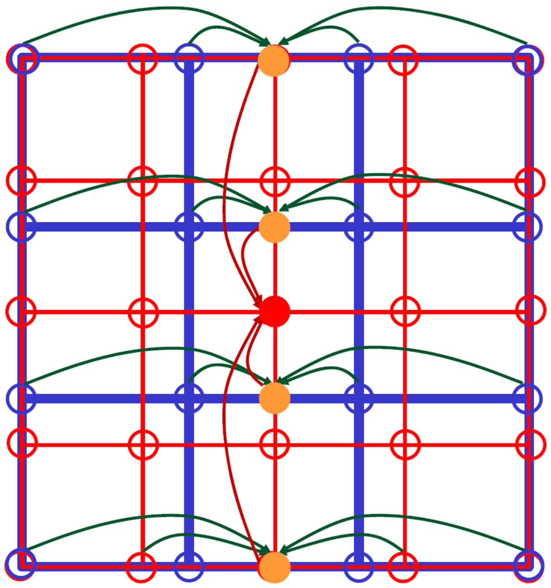
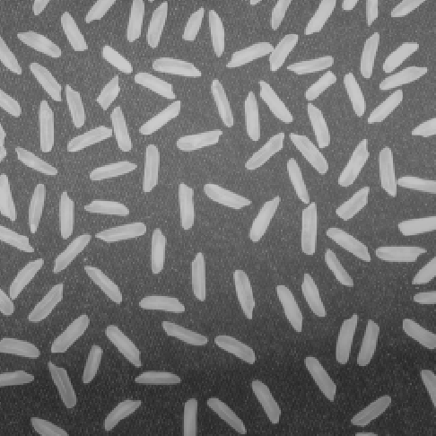
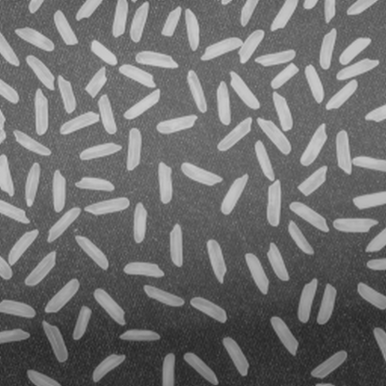

# The Report for Digital Image Processing Laboratory 2

This report is contributed by HUANG Guanchao, SID 11912309, from SME. The complete resources of this laboratory, including source code, figures and report in both `.md` and `.pdf` format can be retrieved at [my GitHub repo](https://github.com/SamuelHuang2019/dip-lab)

[toc]

---

## Introduction

Interpolation is the process of using known data to estimate unknown values. Image interpolation, sometimes called resampling, is an imaging method to increase (or decrease) the number of pixels in a digital image. For examples, zooming, shrinking, rotating, and geometric correction. Some digital cameras use interpolation to produce a larger image than the sensor captured or to create digital zoom.

There are a varieties of methods for image interpolation, each has different hardware usage and slight but noticeable difference in appearance. In this laboratory session, three different interpolation algorithms are implemented and compared.


>The raw image `rice.tif`, 8-bit gray-scale, 256 by 256, file size 64.6KB.

In this laboratory session, the picture "rice" is used as the original image.

---

## Methodology

Consider the case for enlarging a 4 by 4 picture (shown in blue) to a 5 by 5 picture (shown in red) in the diagram, in which each circles represents a pixel. It is obvious that, not every red circles lies exactly at the position of a corresponding blue circle. Therefore, the intensity values at these red circles need to be approximated by values on other blue circles near them.



There are three widely used interpolating methods, nearest nearest-neighbor, linear and cubic. In 2D image interpolation cases, 2D nearest-neighbor, bilinear and bicubic.



- 2D nearest-neighbor
  Select the geometrically nearest pixel in the raw image as the intensity value that is to be interpolated.
- Bilinear
  Apply linear interpolation twice to find two values at position colinear to the pixel that is to be interpolated, then apply linear interpolation again to obtain the final result.
- Bicubic
  Similar to bilinear interpolation, but in total 5 cubic interpolations are done, since approximate a value with cube polynomial requires 4 points.

The general procedure of the algorithms is shown in the flowchart below.



---

## `Python` Implementation

The three interpolation methods are implemented with `Python`, using `opencv2` and `numpy` package.

In the following codes, the meaning of the variables are shown in the table below.

| Variable Names                | Definition                                                                                                  |
| ----------------------------- | ----------------------------------------------------------------------------------------------------------- |
| `dim`                         | The parameter of the function, symbolizing the target size of the enlarged or shrunk image.                 |
| `raw_pic` and `target_pic`    | The `numpy` arrays symbolizing the raw and target image.                                                    |
| `raw_row` and `raw_col`       | The `x` and `y` dimension of the raw image                                                                  |
| `target_row` and `target_col` | The `x` and `y` dimension of the enlarging or shrinking target.                                             |
| `target_x` and `target_y`     | The  `x` and `y` position of the pixels in the target image mapped into to the dimension of the draw image. |

### 2D Nearest-Neighbor


>The principle for conducting 2D nearest-neighbor interpolation. Note that the two gray arrows in the middle does not symbolize taking average, instead when the intended pixel is right at the middle of two raw pixels, intensity value from any of the two is allowed.

Firstly, the image is read using `opencv2` in gray-scale format, and the dimensions of the images are obtained.

```python
def nearest(input_file: str, dim, output_file: str = 'test.tif') -> np.ndarray:
    target_row, target_col = dim
    raw_pic = cv.imread(input_file, cv.IMREAD_GRAYSCALE)
    raw_row, raw_col = raw_pic.shape
```

Using `numpy.linspace()` function, generate the mapped position of the pixels.

```python
    target_x = np.linspace(0, raw_row - 1, num=target_row)
    target_y = np.linspace(0, raw_col - 1, num=target_col)
```

The array representing the target image is initialized with `numpy.zeroes()` function.

```python
    target_pic = np.zeros((target_row, target_col), dtype=np.uint8)
```

>This sentence specifies the data type as `numpy.uint8`, which is not necessary in this interpolation method, but crucial in the following two, and will be explained in the [Gotchas](#Gotchas) part.

Then, using built-in `round()` function, round the pixel positions to the nearest integer, and assign the corresponding intensity values in the raw image.

```python
    for x in range(target_row):
         for y in range(target_col):
             target_pic[x, y] = raw_pic[round(target_x[x]),
                                        raw_pic[round(target_y[y])]]
```

Finally, write the files, and return the resulting array.

```python
    cv.imwrite(output_file, target_pic)
    return target_pic
```

2D nearest-neighbor is the simplest interpolating method and can be easily realized using `Python`. The above presents a simpler implementation, here is another implementation which I wrote at the beginning.

```python
    row_scale = raw_row / target_row
    col_scale = raw_col / target_col
    
    target_pic = np.zeros((target_row, target_col), dtype=np.uint8)
    for target_x in range(target_row):
        raw_x = min(round(target_x * row_scale), raw_row - 1)
        for target_y in range(target_col):
            raw_y = min(round(target_y * col_scale), raw_col - 1)
            target_pic[target_x, target_y] = raw_pic[raw_x, raw_y]
```

In this implementation, the enlarging or shrinking scales on the row and column axis are evaluated first. Then, the indexes of the each pixels in the target images are multiplied by the corresponding scale, and then rounded to the nearest integer. The general idea of these two implementations are identical, but the latter one is more complicated and less elegant.

### Bilinear

Bilinear interpolation is slightly more complex than the 2D nearest-neighbors interpolation. The procedure is described in the diagram below.



The read-write, variables initializing and functions definition parts are the same as previously mentioned.

```python
for x in range(target_row):
    if target_x[x] == int(target_x[x]):
        for y in range(target_col):
            if target_y[y] == int(target_y[y]):
                target_pic[x, y] = raw_pic[int(target_x[x]), int(target_y[y])]
            else:
                yf = int(target_y[y])
                yc = yf + 1
                target_pic[x, y] = (target_y[y] - yf) * \
                                   (int(raw_pic[int(target_x[x]), yc]) -
                                    int(raw_pic[int(target_x[x]), yf]))
    else:
        xf = int(target_x[x])
        xc = xf + 1
        for y in range(target_col):
            if target_y[y] == int(target_y[y]):
                target_pic[x, y] = (target_x[x] - xf) * \
                                   (int(raw_pic[xc, int(target_y[y])]) -
                                    int(raw_pic[xf, int(target_y[y])]))
            else:
                yf = int(y)
                yc = yf + 1

                xl = (target_x[x] - xf) * \
                    (int(raw_pic[xc, yf]) - int(raw_pic[xf, yf]))
                xr = (target_x[x] - xf) * \
                    (int(raw_pic[xc, yc]) - int(raw_pic[xf, yc]))

                target_pic[x, y] = (int(target_y[y]) - yf) * (xr - xl)
```

In the code block above, first judges whether the mapped pixels positions are integer, namely exactly lies at pixels in the raw image or not. If not so, use the nearest two pixels to conduct linear interpolation to find the intensity value.

However, we may combine all these conditions together to simplify the code significantly as shown in the code block below.

```python
for x in range(target_row):
    xf = int(target_x[x])
    xc = min(xf + 1, raw_row - 1)
    for y in range(target_col):
        yf = int(target_y[y])
        yc = min(yf + 1, raw_row - 1)

        vl = raw_pic[xf, yf] + (target_x[x] - xf) * \
            (int(raw_pic[xc, yf]) - int(raw_pic[xf, yf]))
        vr = raw_pic[xf, yc] + (target_x[x] - xf) * \
            (int(raw_pic[xc, yc]) - int(raw_pic[xf, yc]))

        target_pic[x, y] = vl + (target_y[y] - yf) * (vr - vl)
```

>Notice that in the above implementation, type casting is introduced in subtraction such as `int(raw_pic[xc, yf]) - int(raw_pic[xf, yf])`, which seems to be redundant but in fact necessary. See [Gotchas](#Gotchas)

### Bicubic

Bicubic is the most complex method among the three interpolation algorithms, since each approximation requires data from 4 extra pixels. The method is described in the diagram below.



With the help of function `interpolate.interp2d()` from `SciPy` package, the core functionality of this method can be realized in only two lines.

```python
f = interp2d(range(raw_row), range(raw_col), raw_pic, kind='cubic')
target_pic = f(target_x, target_y)
```

In which, `f` is the "interpolator" generated, and can be used for finding the values at any positions conveniently.

>The `interpolate.interp2d()` function is convenient for use and is fast in processing data. However, many developers suggest that there are many gotchas in this function, and usage of this function  should be avoided. For example, in this case, if the parameter `range(raw_row)` and `range(raw_col)` are not in ascending order, the result might be completely incorrect.

---

## Comparison

The following three figures are the enlarged images using 2D nearest-neighbor, bilinear and bicubic method. The format of these figures are identical, in `.tif` format, 8-bit gray-scale, 486 by 486 pixels, horizontal and vertical resolution 96 dpi, LZW compressed.

- 2D nearest-neighbor

    

    >Enlarged by 2D nearest-neighbor interpolation, the files size is 122KB.

- Bilinear

    

    >Enlarged by bilinear interpolation, the files size is 153KB.

- Bicubic

    

    >Enlarged by bicubic interpolation, the files size is 172KB.

The following three figures are the shrunk images using 2D nearest-neighbor, bilinear and bicubic method.

- 2D nearest-neighbor

    

    >Shrunk by 2D nearest-neighbor interpolation, the files size is 48.0KB.

- Bilinear

    

    >Shrunk by bilinear interpolation, the files size is 44.6KB.

- Bicubic

    

    >Shrunk by bicubic interpolation, the files size is 47.2KB.

In a general glance, all of the three methods achieved the goal of enlarging and shrinking an image. However, there are still difference between these methods in details of the picture.

- 2D nearest-neighbor interpolation has shaper edges, but the silhouettes are noticeably jagged-toothed.
- Bilinear interpolation generates more smooth images, however, the resulting image is slightly blurred and less sharp.
- Bicubic interpolation possesses the advantages of both the other two methods and hence the best interpolation effect.

In conclusion, once the performance allows, bicubic interpolation should be applied in order to achieve best visual effect.

In addition to this, there is tiny difference between the file sizes of the images, the reason remained unknown.

## Gotchas

Overall, the algorithms for interpolation in this lab session are easy to implement. however, there are still a few gotchas that are confusing.

### Showing Gray-Scale Images Using `matplotlib`

In `opencv2` package, the `imshow()` function must be followed by a `waitKey()` command, otherwise the window will be generated and closed immediately, which is quite inconvenient. Moreover,  `opencv2` does not support showing figures in built-in SciView of PyCharm. Therefore, `matplotlib` package is more flexible in showing images.

However, showing gray-scale images using `matplotlib` directly is incorrect. An image, or an `numpy` array with only one channel is not considered as a gray-scale image, instead as the first channel, hence is presented incorrectly.


As an alternative, add parameter `cmap='gray'` while invoking `imshow()` function will change the appearance to black-and-white, but still different from the original image.


The only solution found so far, is concatenating the rest empty channels to the image array.

### Data Type Troubles in Image Processing

While saving an `numpy` array as an image file using `cv2.imwrite()` as a `.tif` file, the resulting image might be corrupted and cannot be displayed. This is due to some values in the array is floating number, and the `dtype` attribute of the array is `numpy.float32` or `numpy.float64`, hence cannot be stored in a `.tif` file.

>According to the comment in the source code of `cv2.imwrite()` function, 32-bit float (CV_32F) images can be stored in TIFF format, but in practice not, which is weird. The same error does not occur in PNG format.

The simplest way dealing with this is by specifying the data type when initializing the array.

```python
target_pic = np.zeros((target_row, target_col), dtype=np.uint8)
```

However, this may lead to another error in subtraction, since negative values are not allowed for unsigned data type. A simple way to prevent this is by changing the data type to `numpy.int16` for 8-bit color image. My solution is adding a `int` type casting before conducting subtraction.

```python
vl = raw_pic[xf, yf] + (target_x[x] - xf) * \
    (int(raw_pic[xc, yf]) - int(raw_pic[xf, yf]))
```

Another approach is, convert the data type before writing image files.

```python
cv.imwrite(output_file, target_pic.astype(np.uint8))
```
