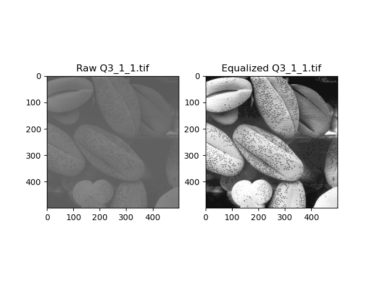
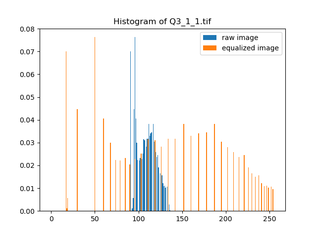
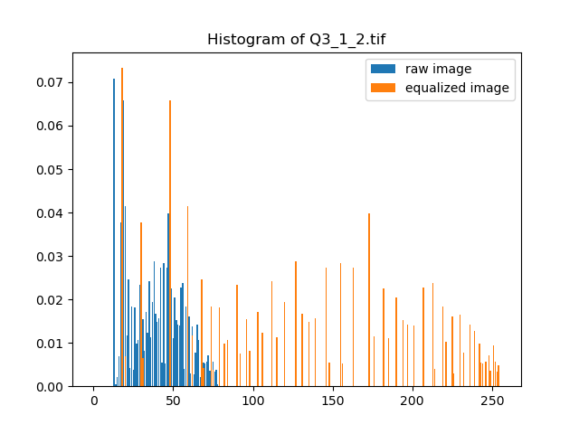
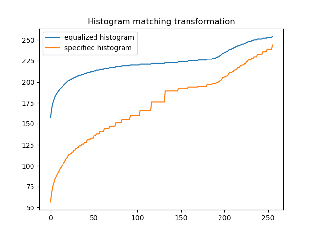
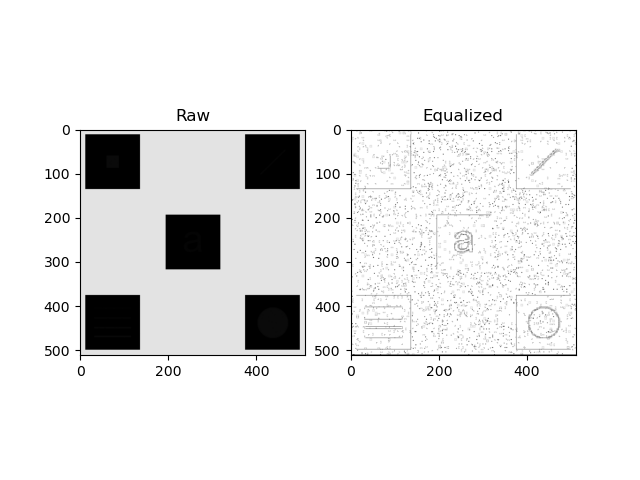
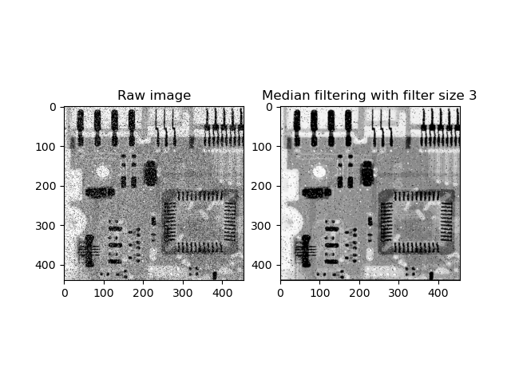
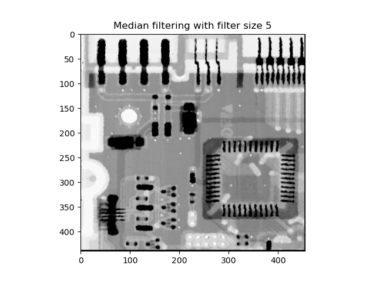

# The Report for Digital Image Processing Laboratory 2

This report is contributed by HUANG Guanchao, SID 11912309, from SME. The complete resources of this laboratory, including source code, figures and report in both `.md` and `.pdf` format can be retrieved at [my GitHub repo](https://github.com/kommunium/dip-lab)

[toc]

---

## Introduction

*Histogram* is a statistical property of a digital image, symbolizing the distributions of pixels of different intensity levels. Histogram is defined as $h(r_k) = n_k$, in which $r_k$ is the $k$th intensity value, $n_k$ is the number of pixels in the image with intensity $r_k$. A generalized concept is *normalized histogram*, which is the counts of the pixels of various intensity levels divided by the total numbers of pixels in the image, hence the sum of which should be normalized to $1$.

Image histograms are present on many modern digital cameras. Photographers can use them as an aid to show the distribution of tones captured, and whether image detail has been lost to blown-out highlights or blacked-out shadows. This is less useful when using a raw image format, as the dynamic range of the displayed image may only be an approximation to that in the raw file.[^Wiki].

[^Wiki]: See Wikipedia *image histogram*

Histogram offers a quantitative rubric for the contrast of an image, namely a well-enhanced image should have evenly distributed histogram in most of the cases, which also provides a methodology for image enhancing.

This lab session is mainly about the utilities of histogram in digital images enhancement. Histogram equalization, histogram matching and local histogram equalization are implemented with `Python` and the results of which are compared.

This lab session also contains utilizing median smoothing to reduce salt-and-pepper noise, which presents better result than simple average smoothing.

As for the summation, see [Conclusion](#Conclusion).

---

## Histogram Equalization

A general way to enhance the contrast of a digital image is histogram equalization, which maps the intensity levels in the raw images to another set of grey scales to form evenly distributed histogram.

### Methodology for Histogram Equalization

The intensity levels in an image may be viewed as random variables in the interval $[0, L-1]$. Let $p_r(r)$ and $p_s(s)$ denote the probability density function (PDF) of random variables $r$ and $s$. Hence, we have the relation

$$
p_s(s) = p_r(r)\left|\frac{dr}{ds}\right|.
$$

Based on which, a transformation function of particular importance in image processing can be formed as

$$
s = T(r) = (L - 1)\int_0^r p_r(w)\mathop{dw}.
$$

To verify this transformation, examining the PDF.

$$
\begin{aligned} &
\frac{ds}{dr} =
\frac{dT(r)}{dr} =
(L-1)\frac{d}{dr} \int_0^r p_r(w)\mathop{dw} =
(L-1)p_r(r) \\ \Rightarrow &
p_s(s) =
\frac{p_r(r)\mathop{dr}}{ds} =
\frac{p_r(r)}{ds/dr} =
\frac{p_r(r)}{(L - 1)p_r(r)} =
\frac{1}{L - 1}
\end{aligned}
$$

Which is a constant, and exactly the even distribution. Similarly, the corresponding transformation in discrete case is expressed in forms of summation.

$$
s_k =
T(r_k) =
(L - 1) \sum_{j=0}^k p_r(r_j) =
(L - 1) \sum_{j=0}^k \frac{n_j}{MN} =
\frac{L-1}{MN} \sum_{j=0}^k n_j
$$

In which, $k = 0, 1, \dots, L-1$.

### `Python` Implementation for Histogram Equalization

The total process can be implemented within less than 10 lines of code, which is also straightforward.

```python
def hist_equ(in_image: np.ndarray):

    L = 2 ** 8
    bins = range(L + 1)

    in_hist, _ = np.histogram(in_img.flat, bins=bins, density=True)
    s = np.array([(L - 1) * sum(in_hist[:k + 1]) for k in range(L)])

    out_img = np.array([s[r] for r in in_img], int).reshape(in_img.shape)
    out_hist, _ = np.histogram(out_img.flat, bins=bins, density=True)

    return out_img, out_hist, in_hist
```

### Results of Histogram Equalization

The result of histogram equalization for `Q3_1_1.tif` is shown below. It is obvious that the dynamic range of the image is prominently enhanced.



It is also clear that, the histogram of the enhanced image distributes over a much wider range.



The histogram equalization also had excellent effects on image `Q3_1_2.tif`, which is darker than `Q3_1_1.tif`, but the result is also striking.




However, though the visual effects of equalized images became better, they are noticeably less smooth than the raw images. This result is natural since for `Q3_1_1.tif`, 42 grey-scale levels were reduced to 39, and for `Q3_1_2.tif`, 70 were reduced to 62, but the grey-scales are distributed in a larger range within $[0, 255]$. In the original images, pixels are grouped in a small range of grey-scales, therefore seems to be smoother.

---

## Histogram Matching

Histogram equalization is not suitable for all cases, and sometimes *histogram matching*, which is a superset of histogram equalization would take advantages.

### Methodology for Histogram Matching

Similar to histogram equalization, first specify the equalized transformation $s$.

$$
s = T(r) = (L - 1)\int_0^r p_r(w)\mathop{dw}
$$

Then, $s$ is considered as an intermediate variable, the specified histogram $z$ satisfies

$$
G(z) = (L - 1)\int_0^r p_r(w)\mathop{dw} = s.
$$

That is, the equalizing transformation for both the raw histogram and the target histogram should be identical. Based on which we may form the mapping from $s$ to $k$, hence the mapping from $r$ to $z$ can be further obtained.

$$
z = G^{-1}(s) = G^{-1}[T(r)]
$$

The transformation for discrete cases is similar.

$$
\begin{cases}\displaystyle
s_k =
T(r_k) =
(L - 1) \sum_{j=0}^k p_r(r_j) =
\frac{L-1}{MN} \sum_{j=0}^k n_j \\ \displaystyle
G(z_q) =
(L-1) \sum_{i=0}^q p_z(r_j) =
s_k
\end{cases}\Rightarrow
z_q = G^{-1}(s_k)
$$

### `Python` Implementation for Histogram Matching

The algorithm could be implemented with 20 lines of `Python` code.

```python
def hist_match(input_image: str, spec_hist=None):

    raw_img = cv.imread(input_image, cv.IMREAD_GRAYSCALE)
    L = 2 ** 8
    if spec_hist is None:
        spec_hist = np.array([1 / L] * L)
    bins = range(L + 1)

    input_hist, _ = np.histogram(raw_img.flat, bins=bins, density=True)
    s = np.array([(L - 1) * input_hist[:k + 1].sum() for k in range(L)], int)
    g = np.array([(L - 1) * spec_hist[:q + 1].sum() for q in range(L)], int)
    z = np.array([np.abs(g - e).argmin() for e in s], int)

    out_img = np.array([z[r] for r in raw_img], int).reshape(raw_img.shape)
    output_hist, _ = np.histogram(out_img.flat, bins=bins, density=True)

    return out_img, output_hist, input_hist
```

In this script, if the input `spec_hist` is not specified, normal histogram equalization is implemented.

### Results of Histogram Matching

For unspecified target histogram, the result of histogram equalization for the original image is not pleasant, then resulting image tends to be too bright, and is still of low contrast.


From the histogram, it is clear that, when most of the pixels are grouped in a small range of particular intensity levels, histogram equalization only moves the histogram to another intensity level, without intensifying the contrast.


The target histogram for further processing is defined in the code block below.

```python
hist = np.concatenate((np.linspace(0, 7, 8 - 0),
                       np.linspace(7, 0.75, 16 - 8),
                       np.linspace(0.75, 0, 184 - 16),
                       np.linspace(0, 0.5, 200 - 184),
                       np.linspace(0.5, 0, 256 - 200)), axis=0)
hist = hist / hist.sum()
```

The result is greatly improved compare with common histogram equalization, the details in both bright and dim region are maintained and enhanced.


From the histogram, it is discover that, though a great number of pixels are grouped in small range of intensity levels, the overall dynamic range is increased.


The intensity transformation curve further states the fact that, histogram matching is capable for mapping the intensity level to larger range.



---

## Local Histogram Equalization

### Methodology for Local Histogram Equalization

Local histogram equalization is similar to common histogram equalization.

First, a neighborhood is defined, the its center is moved from pixel to pixel. At each location, the histogram of the points in the neighborhood is computed, either histogram equalization or histogram specification transformation function is obtained. Then, the intensity of the pixel centered in the neighborhood is mapped correspondingly. The neighborhood is moved to the next location and the procedure is repeated.

>In my practice, the local histogram equalization is not done pixel-wise, instead, it is done once a `m_size` by `m_size` pixels block. The results are also effective, and more efficient in performance.

### `Python` Implementation for Local Histogram Equalization

The initial script is shown below.

```python
def local_hist_equ(in_img, m_size):

    row, col = in_img.shape
    out_img = np.zeros(in_img.shape, int)

    L = 2 ** 8
    bins = range(L + 1)
    for i in list(range(0, row - m_size, m_size)) + [row - m_size - 1]:
        for j in list(range(0, col - m_size, m_size)) + [col - m_size - 1]:
            local_img = in_img[i:i + m_size, j:j + m_size]
            local_hist, _ = np.histogram(local_img.flat, bins=bins, density=True)
            s = np.array([(L - 1) * sum(local_hist[:k + 1]) for k in range(L)])
            out_img[i:i + m_size, j:j + m_size] = np.array([s[r] for r in local_img], int).reshape([m_size] * 2)

    return out_img
```

Invoke this method with command shown below.

```python
raw_img = cv.imread("Q3_3.tif", cv.IMREAD_GRAYSCALE)
local_hist_equ(raw_img, 3)
```

The runtime is noticeably too long, for `m_size` set to be `3`, it took up to about 170,000 ms in total executing the script. Using the `cProfile` tool, we may observe the performance bottleneck of the script.


More detailed, the functions invoked in the script with top 5 own CPU time are shown in the table below.

| Name                             | Call Count | Time (ms) | Own Time (ms) |
| -------------------------------- | ---------: | --------: | ------------: |
| `<built-in method builtins.sum>` |    7485766 |    155963 |        155963 |
| `<listcomp>`                     |      29241 |    161319 |          5355 |
| `<built-in method numpy.array>`  |     294197 |      2942 |          2942 |
| `local_hist_equ`                 |          1 |    168648 |           754 |
| `histogram`                      |      29241 |      4939 |           564 |
| `<listcomp>`                     |      29241 |       345 |           345 |

The `<listcomp>` method is for the integrated style of implementing `Python` `list` datatype, and in this script, two lines of such code are introduced.

```python
s = np.array([(L - 1) * sum(local_hist[:k + 1]) for k in range(L)])

out_img[i:i + m_size, j:j + m_size] = np.array([s[r] for r in local_img], int).reshape
```

Furthermore, it is the `<built-in method builtins.sum>` that occupied most of the runtime in `<listcomp>`. Therefore, it is natural for replace list composition sentence with `numpy` array and simple `for` loop, and to utilize the performance boost provided by `numpy` package in summation.

The code for creating the mapping array `s` is optimized with `numpy.ndarray.sum()` is shown below.

```python
s = np.array([(L - 1) * local_hist[:k + 1].sum() for k in range(L)])
```

The result of the optimization is shown below.


The runtime of the total program is greatly reduced to only about 27,000 ms.

### Results of Local Histogram Equalization

With `m_size` set to be `3`, the result of local histogram equalization is shown below.



The black boxes in the original image contains detailed information, which is revealed through local histogram equalization.

The result also varies with different `m_size` chosen. As the `m_size` increases, the


Generally, larger `m_size` chosen, the edges of the extracted patterns become less sharp. If the `m_size` gets too large, local his would no longer be unable to reveal the hidden patterns.

>It is also discovered that, when choosing greater `m_size`, the efficiency of the program increases prominently, but the image enhancement results are not acceptable.

---

## Reducing Salt-and-Pepper Noise

### Methodology for Reducing Salt-and-Pepper Noise

*Salt-and-pepper noise*, or *impulse noise* is a common noise with some of the pixels have 0 intensity while others may have maximum intensity. Filters that cancel the noise by averaging cannot deal with salt-and-pepper noise properly, in this case, *median filtering* may have good effects.

For reducing salt-and-pepper noise, each time the neighbor around a pixel is extracted, and the intensity value at the center is replaced with the median value. The procedure is then repeated to create a noise-reduced image.

### `Python` Implementation of Median Filtering

With the help of `numpy.median()` function, median filtering could be easily implemented. Note that, at the edges of the image, the missing pixels are considered as 0.

```python
def reduce_sap(input_image, n_size):

    m = (n_size - 1) // 2
    row, col = input_image.shape
    L = 2 ** 8
    bins = range(L + 1)
    input_hist, _ = np.histogram(input_image.flat, bins=bins, density=True)

    temp_image = np.pad(input_image, [m, m], 'constant', constant_values=[0] * 2)
    output_image = np.zeros((row, col))

    for i in range(m, row):
        for j in range(m, col):
            output_image[i - m, j - m] = np.median(temp_image[i - m:i + m, j - m:j + m])

    output_hist, _ = np.histogram(output_image.flat, bins=bins, density=True)

    return output_image, output_hist, input_hist
```

### Results of Median Filtering

For `n_size` chosen as 3, the salt-and-pepper noise is reduced partially, but still not ideal. When zoomed in, it is observed that some noise regions are particles with relatively large size. Therefore, it is natural for selecting larger `n_size`.



With filer size set to be 5 by 5, most of the noise were canceled, the resulting image is clean and smooth.



---

## Conclusion

All the algorithms have ideal effects on corresponding tasks.

- Histogram Equalization
  - The images gained higher dynamic range, due to the histogram distributes in a wider range.
  - The resulting images appear to be less smooth, since the grey levels are reduced after equalization, but distributed to even wider range.
- Histogram Matching
  - Common histogram equalization is not capable for enhancing images with large number of pixels grouped in a extreme small range of intensity levels.
  - Therefore, histogram matching has better effects for such tasks compared with normal histogram equalization.
  - The key point of optimizing the result of histogram matching is to find the proper histogram specified.
- Local Histogram Equalization
  - The procedure for conducting local histogram equalization or possibly local histogram matching is similar to that for the entire image.
  - In local histogram equalization, performance cost must be taken into consideration, since the equalization process is repeated a large amount of times.
  - The builtin summation function `sum()` provided by `Python` is far less efficient than that integrated in `numpy` package With the help of `numpy`, the runtime is reduced to about one fifth.
  - Local histogram equalization has the ability to reveal the hidden details, as long as the filter size is selected properly.
- Median Filtering
  - Median filtering can reduce salt-an-pepper noise in the images.
  - The effect of the filtering varies with the size of filter. If large particles of "salt and pepper" remained in the processed image, try larger filter.
