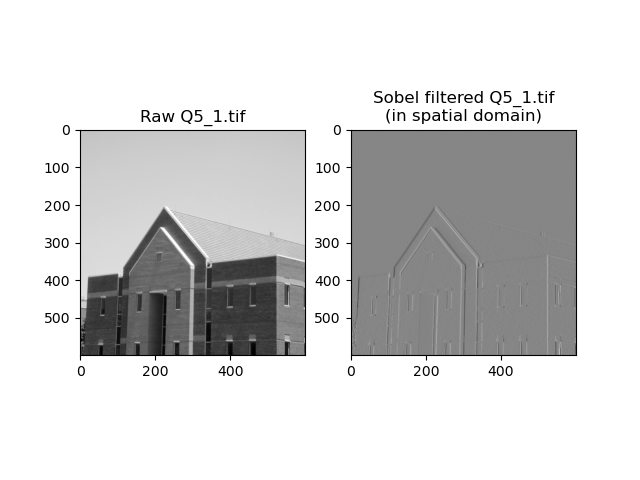
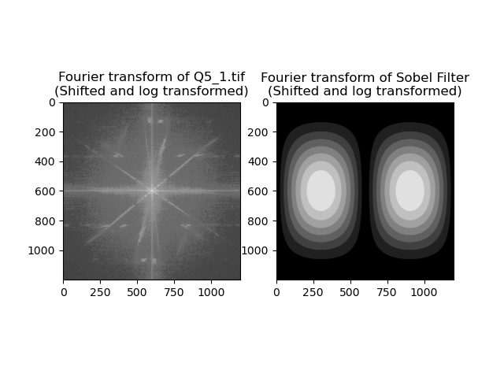
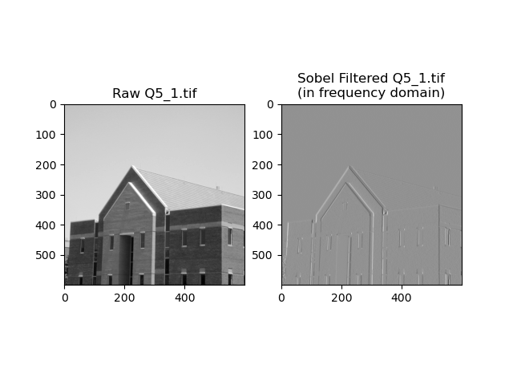
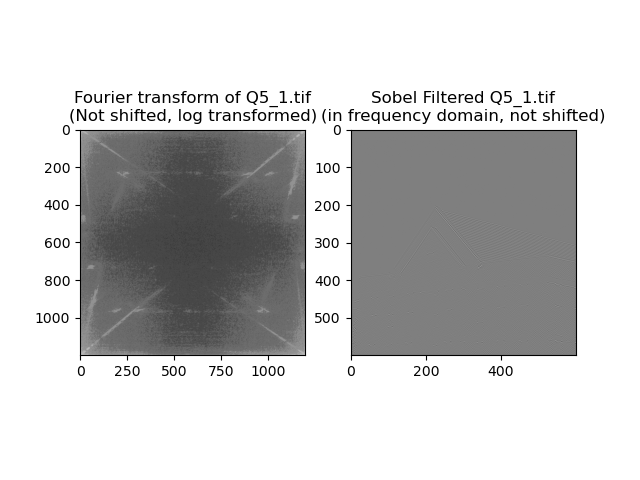
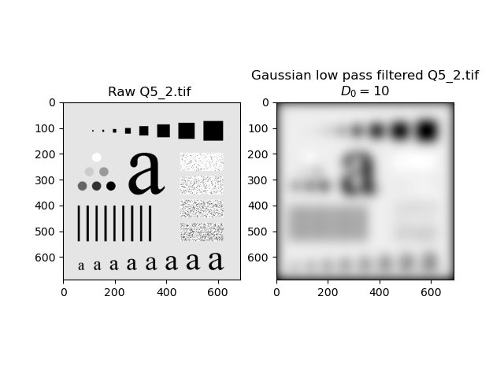
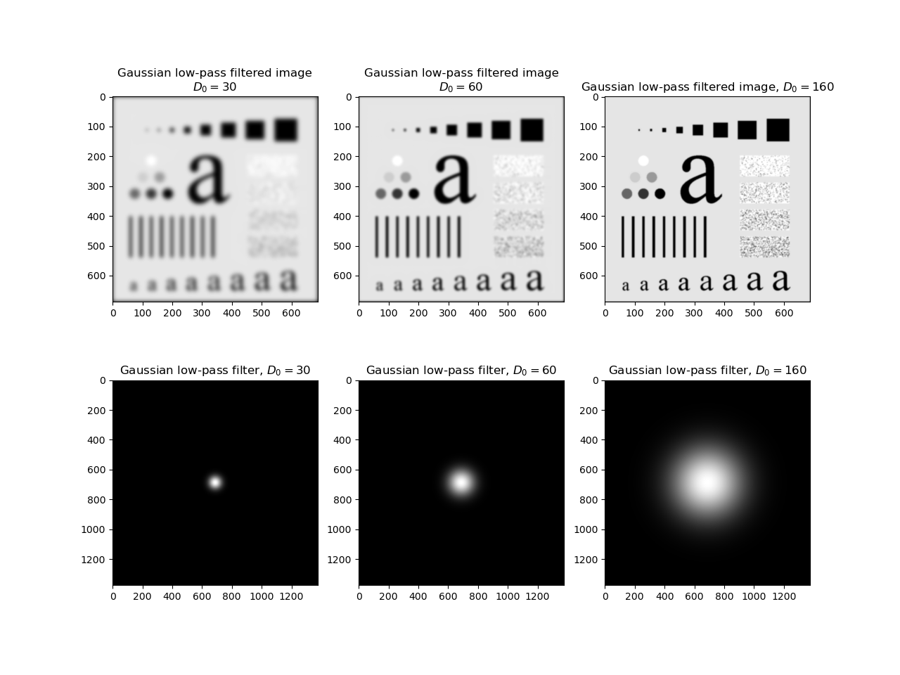
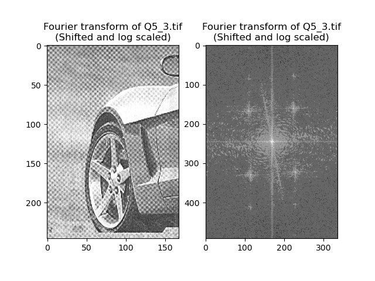
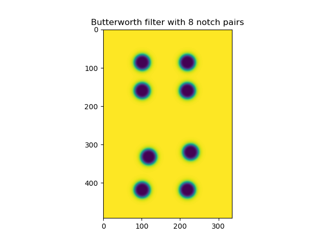
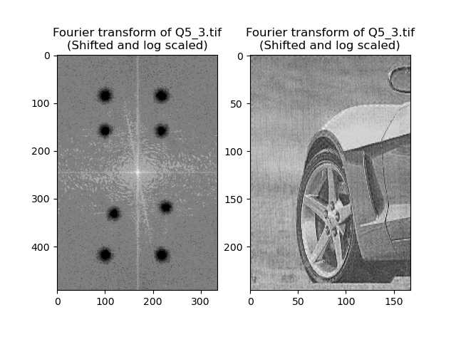

# The Report for Digital Image Processing Laboratory 5

This report is contributed by HUANG Guanchao, SID 11912309, from SME. The complete resources of this laboratory, including source code, figures and report in both `.md` and `.pdf` format can be retrieved at [my GitHub repo](https://github.com/kommunium/dip-lab)

[toc]

## Introduction

Fourier Series and Fourier Transform are named after French mathematician and physicist Jean Baptiste Joseph Fourier. Such technique can analyze any signal and rewrite them into a combination of a series of sinusoidal waves with certain frequencies, and hence provides many advantages in digital images processing.

For digital image processing, that is, in discrete case, the expression of Fourier transform and its inverse is shown below.

$$
F(\mu, \nu) =
\sum_{x=0}^{M-1} \sum_{y=0}^{N-1} f(x, y)
e^{-j2\pi(\mu x / M + \nu y / N)}
$$

$$
f(x, y) =
\frac{1}{MN}\sum_{x=0}^{M-1} \sum_{y=0}^{N-1}
F(\mu, \nu) e^{j2\pi(\mu x / M + \nu y / N)}
$$

In practice, FFT, namely *Fast Fourier Transform* algorithm is adopted by computer to calculate the Fourier transform of a signal.

---

## `Python` Implementation of Fourier Transform

Customized Fourier Transform is implemented first.

```python
import numpy as np
from PIL import Image
from numpy.fft import fft2, fftshift, ifft2
from math import pi

# %% read images
img_raw = np.asarray(Image.open(<filename>))
row, col = img_raw.shape

img_shift = img_raw *
            np.fromfunction(lambda x, y: (-1) ** (x + y), (row, col))
img_fourier = np.asarray([(
                img_raw *
                np.fromfunction(lambda x, y:
                  np.exp(-1j * 2 * pi * (mu * x / row + nu * y / col)),
                  (row, col))).sum()
                for mu in range(row) for nu in range(col)]).reshape(row, col)
```

The whole process for transform can be implemented within a single line. However, the runtime of such algorithm built from scratch is totally unacceptable compared to FFT algorithm. Therefore, in the following practice,
we will use related functions in `numpy.fft`, including `fft2`, `ifft2`, `fftshift` to conduct frequency domain filtering.

---

## Sobel Filtering in Spatial and Frequency Domain

First, read in the image.

```python
img_raw = np.asarray(Image.open('Q5_1.tif'))
row, col = img_raw.shape
```

### Filtering in Spatial Domain

In spatial domain, firstly, generate the filter.

```python
sobel_filter = np.array([[-1, 0, 1],
                         [-2, 0, 2],
                         [-1, 0, 1]])
```

Then, do padding and convolution.

```python
img_pad = np.pad(img_raw, 1)
img_spatial = np.asarray([(img_pad[i:i + 3, j:j + 3] * sobel_filter).sum()
                          for i in range(row)
                          for j in range(col)]).reshape(row, col)
```

The result is shown in the figure below.



### Filtering in Frequency Domain

In frequency domain, first apply fourier transform and a shift, in order to move the DC component with highest energy to the center, to the image and the filter. Padding is also required to avoid aliasing.

```python
img_fourier = fftshift(fft2(np.pad(img_raw, ((0, row), (0, col)))))
filter_fourier = fftshift(fft2(np.pad(sobel_filter, ((0, 2 * row - 3), (0, 2 * col - 3)))))
```

Then, multiply the image and filter in frequency domain. For visualization purpose, the image in frequency domain is taken absolute value and log transformed with a radix of `10`. Data type casting is also required.

```python
img_view = np.log10(np.abs(img_fourier) + 1).astype(np.uint8)
filter_view = np.abs(filter_fourier).astype(np.uint8)
```

The Fourier transform of the raw image and the filter in frequency domain is shown below.



To obtain the final result, do Fourier transform shift again to reposition the origin to the top left, then do inverse Fourier transform, take the real part, and crop the top left quarter accordingly.

```python
img_freq = np.real(ifft2(fftshift(img_fourier * filter_fourier)))[0:row, 0:col]
```

The final result of filtering in frequency domain is shown below.



### Why `fftshift` is Necessary

Fourier transform shift plays a role of shifting the DC component with the highest energy in the frequency domain of the image to the center of picture. Since by default, the origin of the frequency domain would be located at the top left, and the DC component is separated to the four corners of the image, which is not convenient for visualization and filter designation in frequency domain.

If `fftshift` is not applied, the result is shown below.



It is clear that, the information is nearly completely lost.

---

## Gaussian Filtering in Frequency Domain

Gaussian Low-pass Filters (GLPF) in two dimensions is given as

$$
H_\text{GLPF}(\mu, \nu) = e^{-D^2 (\mu, \nu) / 2\sigma^2}.
$$

By letting $\sigma = D_0$, we have

$$
H_\text{GLPF}(\mu, \nu) = e^{-D^2 (\mu, \nu) / 2D_0^2}.
$$

To obtain the corresponding Gaussian High-pass Filter, the low-pass filter is subtracted from $1$.

$$
H_\text{GHPF}(\mu, \nu) = 1 - H_\text{GLPF}(\mu, \nu)
$$

### `Python` Implementation of Gaussian Filtering in Frequency Domain

First, read in the image.

```python
img_raw = np.asarray(Image.open('Q5_2.tif'))
row, col = img_raw.shape
```

Then, do Fourier transform, and corresponding optimization for visualization.

```python
img_fourier = fft2(np.pad(img_raw, ((0, row), (0, col))))
img_view = np.log10(fftshift(np.abs(img_fourier)) + 1).astype(np.uint8)
```


To obtain the Gaussian filter, a subfunction for computing the distance is implemented first.

>Note that, since the subfunction for calculating distance is invoked inside the `lambda` expression of `numpy.fromfunction()`, `numpy.sqrt()` is required, errors may occur using `math.sqrt()` or `cmath.sqrt()`

Then, generate the filter using `numpy.fromfunction()`, by simply integrate the expression of Gaussian filter in the `lambda` expression.

>Similarly, `numpy.exp()` is necessary instead of using `math.exp()` and `cmath.exp()`.

```python
def gaussian(d0: int):
    def d(mu: int, nu: int):
        return np.sqrt((mu - row) ** 2 + (nu - col) ** 2)

    gaussian_lpf = np.fromfunction(lambda mu, nu: np.exp(-d(mu, nu) ** 2 / (2 * d0 ** 2)),
                                   (2 * row, 2 * col))
    img_freq_filtered = img_fourier * fftshift(gaussian_lpf)
    img_filtered = np.real(ifft2(img_freq_filtered))[0:row, 0:col].astype(np.uint8)

    return img_filtered, gaussian_lpf
```

The following process is similar to Sobel filtering in frequency domain.

For $D_0=10$, the result of Gaussian low-pass filtering is shown below.



As for high-pass filtering, adding a single line of code in the function.

```python
gaussian_lpf = np.ones((row * 2, col * 2)) - gaussian_lpf
```

For $D_0=10$, the result of Gaussian high-pass filtering is shown below.


The image is also blurred similar to low-pass filtering.

### The Function of $D_0$ in Gaussian Filtering

The results of Gaussian low-pass filtering with different $D_0$ are shown below.



The results of Gaussian high-pass filtering with different $D_0$ are shown below.


It is apparently that, the parameter $D_0$ determines the radius of the filter. For both high-pass and low-pass filtering, the larger $D_0$ is, the more information in frequency domain is maintained from the raw image, and hence the sharper and clearer the resulting image be.

---

## Butterworth Notch Filtering

Unlike nonselective filters which operate over the entire frequency rectangle, selective filters operate over some part, not entire frequency rectangle. Specifically, band-reject or band-pass filters process specific bands, notch filters process small regions of the frequency rectangle. Furthermore, the relation between band-pass and band-reject filters is given as follows.

$$
H_\text{BP}(\mu,\nu) = 1 - H_\text{BR}(\mu,\nu)
$$

In practice, notch filters must be a zero-shift-filter, namely must be symmetric about the origin. Therefore, a notch with center at $(\mu_0, \nu_0)$ must have a corresponding notch at location $(-\mu_0, -\nu_0)$.

Notch reject filters are constructed as products of high-pass filters whose centers have been translated to the centers of the notches, and is specified as follows.

$$
H_\text{NR}(\mu,\nu) =
\prod_{k=1}^Q H_k(\mu,\nu)H_{-k}(\mu,\nu)
$$

In which $H_k(\mu,\nu)$ and $H_{-k}(\mu,\nu)$ are high-pass filters whose centers are at $(\mu_k,\nu_k)$ and $(-\mu_k,-\nu_k)$, respectively.

More specifically, a Butterworth notch reject filter of order $n$ is expressed as follows.

$$
H_\text{NR}(\mu,\nu) =
\prod_{k=1}^Q
\frac{1}{1+\left[D_{0k}/D_k(\mu,\nu)\right]^{2n}}
\frac{1}{1+\left[D_{0k}/D_{-k}(\mu,\nu)\right]^{2n}}
$$

In which,

$$
\begin{cases}
D_k(\mu,\nu) =
\sqrt{\left(\mu - \dfrac{M}{2} - \mu_k\right)^2 +
\left(\nu - \dfrac{N}{2} - \nu_k\right)^2} \\
D_{-k}(\mu,\nu) =
\sqrt{\left(\mu - \dfrac{M}{2} + \mu_k\right)^2 +
\left(\nu - \dfrac{N}{2} + \nu_k\right)^2} \\
\end{cases}.
$$

### `Python` Implementation of Butterworth Notch Filtering

Firstly, read in the image and do Fourier transformation.

```python
img_raw = np.asarray(Image.open('Q5_3.tif'))
row, col = img_raw.shape

img_fourier = fftshift(fft2(np.pad(img_raw, ((0, row), (0, col)))))
img_view = np.log10(np.abs(img_fourier) + 1).astype(np.uint8)
```

The result is shown below.



It is clear that, the image is degraded by some periodic noises, which corresponding to the 8 bright spots in the frequency domain. The goal is to eliminate these frequency components with Butterworth notch filters.

Similar to the generation of Gaussian filter, a subfunction for calculating distance needs to be implemented first. In this case, the `center` needs to be specified.

>Note that, after padding, the real size of the filter is 2 times the original height and width of the image. However, after trying some parameters, the real center for computing the distance needs to be set as $\mu=M/2$, $\nu=N/2$. That is, in this case, `center=(row / 2, col / 2)`.

```python
def butterworth(n: int = 4, d0: int = 20, center=(row / 2, col / 2)):
    def d(mu: int, nu: int, center=center):
        center_row, center_col = center
        return np.sqrt((mu - row / 2 - center_row) ** 2 + (nu - col / 2 - center_col) ** 2)

    notch_filter = np.fromfunction(lambda mu, nu: 1 / (1 + (d0 / d(mu, nu)) ** (2 * n)),
                                   (2 * row, 2 * col)) * \
                   np.fromfunction(lambda mu, nu: 1 / (1 + (d0 / d(-mu, -nu)) ** (2 * n)),
                                   (2 * row, 2 * col))

    return notch_filter
```

Again, notch pairs can be easily generated using `numpy.fromfunction()`. After trying different centers of notch pairs and comparing the filter with the raw image in frequency domain, the notch pairs are defined as follows, the size of the notch is set as $D_0=20$ in default, the $n=4$ according to the hinting from the textbook.

```python
filter1 = butterworth(center=(-0.15 * row, 0.1 * col))
filter2 = butterworth(center=(-0.15 * row, 0.8 * col))

filter3 = butterworth(center=(0.15 * row, 0.1 * col))
filter4 = butterworth(center=(0.15 * row, 0.8 * col))

filter5 = butterworth(center=(0.85 * row, 0.2 * col))
filter6 = butterworth(center=(0.8 * row, 0.85 * col))

filter7 = butterworth(center=(1.2 * row, 0.1 * col))
filter8 = butterworth(center=(1.2 * row, 0.8 * col))

filter_total = filter1 * filter2 * filter3 * filter4 * filter5 * filter6 * filter7 * filter8
```

The resulting filter is shown below.



```python
img_filtered_fourier = img_fourier * filter_total
img_filtered_fourier_view = np.log10(np.abs(img_filtered_fourier) + 1).astype(np.uint8)
img_filtered = np.real(ifft2(fftshift(img_filtered_fourier)))[0:row, 0:col].astype(np.uint8)
```

Do filtering, then do inverse Fourier transform and shift, the result is shown below.



We can see that the bright spots in the frequency domain were canceled, and the image looks much cleaner.

### Why Must the Filter in Frequency Domain Be Real and Symmetric

The target image can be expressed as

$$
g(x, y) = \mathscr{F}^{-1}\left\{H(\mu, \nu) F(\mu, \nu)\right\}.
$$

The raw image in frequency domain can be expressed as real and imaginary part separately.

$$
F(\mu,\nu) = R(\mu,\nu) + jI(\mu, \nu)
$$

Therefore, the result of filtering can be expressed as

$$
g(x,y) = \mathscr{F}^{-1}\left\{H(\mu,\nu)R(\mu,\nu) + jH(\mu,\nu)I(\mu,\nu)\right\}.
$$

Apparently, in order to maintain the phase of the image, the filter in frequency domain must be zero-phase, namely pure real or imaginary, and in practice real for convenience.

---

## Gotchas

### Using `exp()` in `numpy.fromfunction()`

I used `numpy.fromfunction()` to assist the procedure of Fourier transform, namely to generate the complex exponential component.

$$
e^{-j2\pi(\mu x / M + \nu y / N)}
$$

First of all, the builtin exponential function `math.exp()` only supports powers that could be transferred to `float` type, `complex` type is not available. Therefore, import `exp` from `cmath` package is necessary in such case.

However, while using `numpy.fromfunction()` to generate the corresponding complex `ndarray`, error occurs:

```powershell
  File "<ipython-input-37-ae2e57580c65>", line 2, in <lambda>
    exp(-1 * 2 * pi * (1 * x / row + 1 * y / col)),
TypeError: only length-1 arrays can be converted to Python scalars
```

This error is related to `cmath.exp()`, and can be simply solved by replacing with `numpy.exp()`.

Similarly, for calculating the square root, `numpy.sqrt()` is required instead of `math.sqrt()`
